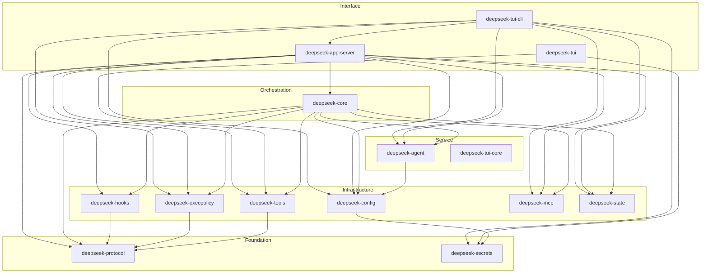

# DeepSeek TUI — 项目架构文档

> 自动生成于 HARNESS 管线：Evaluator → Generator → Coordinator

## 项目概述

DeepSeek TUI 是一个面向 DeepSeek V4 模型的终端编码代理（coding agent），运行于终端环境，支持文件读写、Shell 命令执行、Web 搜索、Git 管理、子代理协调等功能。项目使用 Rust 2024 版本构建，包含 **14 个 workspace crate**。

## 核心模块分层

整个架构分为五层，自底向上：

```
┌──────────────────────────────────────────────────────┐
│                     Interface 层                       │
│  deepseek-tui  deepseek-tui-cli  deepseek-app-server  │
├──────────────────────────────────────────────────────┤
│                  Orchestration 层                       │
│                    deepseek-core                       │
├──────────────────────────────────────────────────────┤
│                   Service 层                            │
│   deepseek-agent  deepseek-tui-core                    │
├──────────────────────────────────────────────────────┤
│                Infrastructure 层                        │
│  deepseek-config  deepseek-tools  deepseek-execpolicy  │
│  deepseek-hooks   deepseek-mcp    deepseek-state       │
├──────────────────────────────────────────────────────┤
│                  Foundation 层                          │
│   deepseek-protocol  deepseek-secrets                  │
└──────────────────────────────────────────────────────┘
```

### Layer 0 — Foundation（基础层）

| Crate | 职责 | 内部依赖 |
|-------|------|----------|
| `deepseek-secrets` | 密钥存储后端（OS keyring + 文件回退） | 无 |
| `deepseek-protocol` | 协议帧定义、工具调用/输出序列化结构 | 无 |

### Layer 1 — Infrastructure（基础设施层）

| Crate | 职责 | 内部依赖 |
|-------|------|----------|
| `deepseek-config` | 配置 schema 和优先级模型 | `secrets` |
| `deepseek-tools` | 工具调用生命周期、schema 校验 | `protocol` |
| `deepseek-execpolicy` | 执行策略和审批模型 | `protocol` |
| `deepseek-hooks` | Hook 分发和通知系统 | `protocol` |
| `deepseek-mcp` | MCP 服务器生命周期管理 | 无 |
| `deepseek-state` | 会话/线程持久化和恢复（SQLite） | 无 |

### Layer 2 — Service（服务层）

| Crate | 职责 | 内部依赖 |
|-------|------|----------|
| `deepseek-agent` | 模型/提供者注册表和 fallback 策略 | `config` |
| `deepseek-tui-core` | 事件驱动的 TUI 状态机骨架 | 无 |

### Layer 3 — Orchestration（编排层）

| Crate | 职责 | 内部依赖 |
|-------|------|----------|
| `deepseek-core` | 核心运行时边界 | `agent`, `config`, `execpolicy`, `hooks`, `mcp`, `protocol`, `state`, `tools` |

### Layer 4 — Interface（接口层）

| Crate | 职责 | 内部依赖 |
|-------|------|----------|
| `deepseek-tui` | 终端 UI（ratatui + crossterm） | `tools`, `secrets` |
| `deepseek-tui-cli` | CLI 门面（`deepseek` 命令） | `agent`, `app-server`, `config`, `execpolicy`, `mcp`, `secrets`, `state` |
| `deepseek-app-server` | HTTP/SSE 运行时 API 服务器 | `core`, `agent`, `config`, `execpolicy`, `hooks`, `mcp`, `protocol`, `state`, `tools` |

## Mermaid 模块依赖图



## 关键构建信息

- **Rust 版本**: 1.88+（2024 edition）
- **版本**: 0.8.39（workspace 统一版本号）
- **默认成员**: `deepseek-tui-cli`, `deepseek-app-server`, `deepseek-tui`
- **许可证**: MIT
- **仓库**: https://github.com/Hmbown/DeepSeek-TUI

## 架构特点

1. **单向依赖**：依赖方向严格自底向上，Foundation 层不依赖上层 crate
2. **协议统一**：`deepseek-protocol` 作为跨层通信契约
3. **配置先决**：`deepseek-config` 依赖 `deepseek-secrets`，确保密钥先于配置加载
4. **分层测试**：每层可独立测试，`deepseek-protocol` 提供合约快照测试
